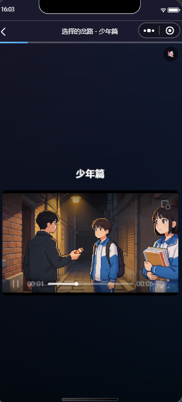
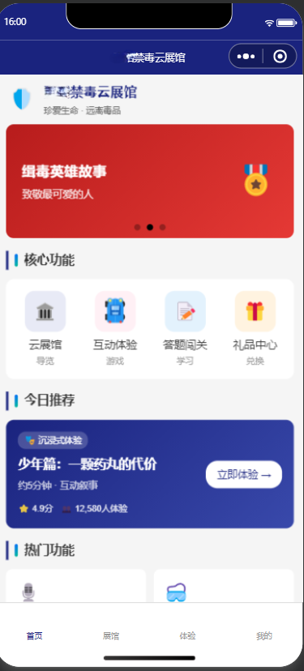
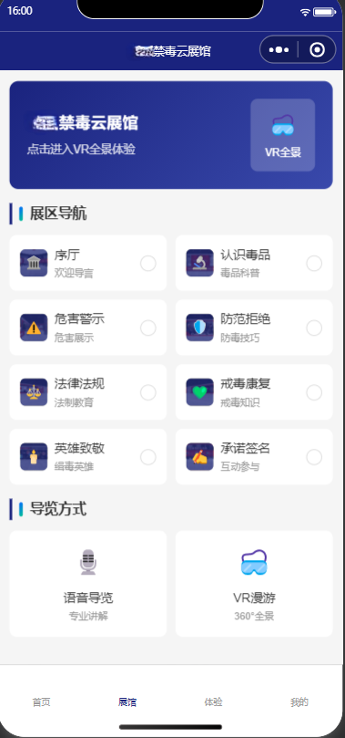
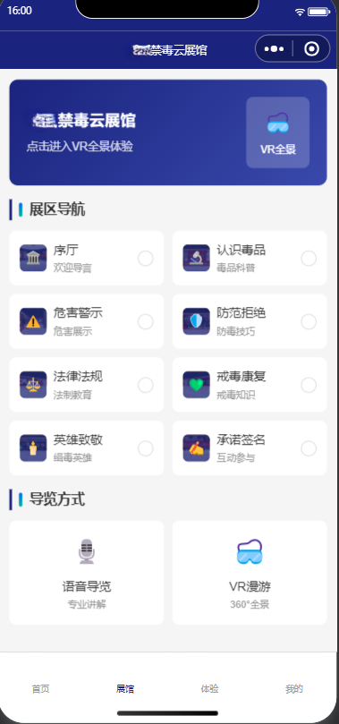
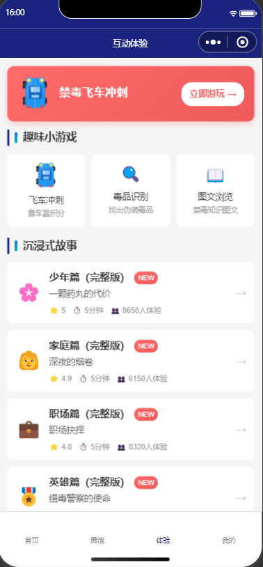
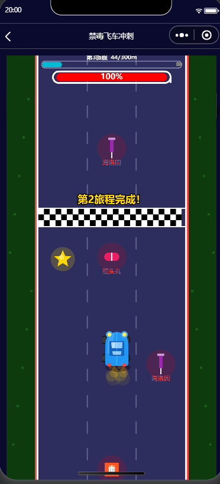

<p align="center">
  
</p>
<h1 align="center">禁毒开源 Drug Education Mini Program</h1>

<p align="center">
  <strong>禁毒教育小程序 · 云展馆导览 · 互动体验 · 答题积分 · 静态可运行</strong>
</p>

<p align="center">
  <a href="LICENSE"></a>
  
  
</p>

<p align="center">
  <strong>中文</strong> | <a href="README_EN.md">English</a>
</p>

<p align="center">
  <a href="miniprogram/STATIC_RUN.md"><strong>静态运行说明</strong></a> •
  <a href="#功能特性">功能特性</a> •
  <a href="#快速开始">快速开始</a> •
  <a href="#技术架构">技术架构</a> •
  <a href="#许可证">许可证</a> •
  <a href="#贡献">贡献</a>
</p>

---

<p align="center">
  
</p>

## 简介

**禁毒开源** 是一个面向禁毒教育宣传场景的微信小程序项目，覆盖从内容展示到互动学习的完整链路：

> 首页宣传 -> 云展馆导览 -> 互动体验 -> 知识答题 -> 学习记录

项目默认支持静态运行模式，无需后端接口即可本地演示核心流程，适合功能展示、方案汇报和二次开发。

## 功能特性

### 核心体验板块：云展馆 + 互动学习
- 多主题展区内容组织（导览、科普、警示、法治、承诺）
- 互动式学习流程（参观、问答、签名、积分反馈）
- 静态数据驱动，可离线演示主流程

### 沉浸式故事引擎
- 青少年、家庭、职场、英雄等多条故事线
- 选择分支与不同结局反馈
- 结局积分奖励与本地记录联动

<table>
  <tr>
    <td></td>
    <td></td>
  </tr>
</table>

### 禁毒答题系统
- 内置题库，支持多模式答题
- 实时判题与解析展示
- 正确率、得分、学习记录本地统计

### 图文与展区内容管理
- 展区内容按 section 分组展示
- 图文科普、危险等级、提示信息统一渲染
- 便于后续扩展本地题库和素材包

<table>
  <tr>
    <td></td>
    <td></td>
  </tr>
</table>

### VR + 语音导览
- VR 场景浏览（本地数据可回退）
- 语音导览列表与播放控制
- 适配静态运行及后端联调两种模式

### 积分激励与礼品兑换
- 学习行为积分（签到、答题、体验等）
- 礼品兑换流程（静态 mock 可运行）
- 学习统计与记录可视化页面

### 界面预览（2×2）

<table>
  <tr>
    <td></td>
    <td></td>
  </tr>
  <tr>
    <td></td>
    <td></td>
  </tr>
</table>

### 静态 Mock API 调度
- `utils/api.js` 统一接口层
- `mockData=true` 时自动走本地数据
- 保留切换真实后端的能力

### 下载
- 当前仓库为源码版本，建议直接克隆后在微信开发者工具中运行。
- 如需打包发布，请按你所在组织的发布流程处理 AppID、备案与合规检查。

## 快速开始

### 环境要求

- 微信开发者工具（最新稳定版）
- Node.js >= 18（可选，仅用于脚本检查）

### 安装运行

```bash
# 克隆仓库
git clone <your-repo-url>
cd 禁毒开源

# 导入微信开发者工具
# 选择目录：禁毒开源/miniprogram
```

### 配置 API Key

本项目默认是静态 mock 运行，不需要 API Key。  
如果要切换真实后端，可在 `miniprogram/config/app.js` 中关闭 `mockData` 并配置后端地址。

### 构建

```bash
# 小程序项目无需传统构建，直接在微信开发者工具编译
# 可选：仅做语法检查
node --check miniprogram/utils/api.js
```

## 技术架构

| 层级 | 技术 |
|------|------|
| 客户端框架 | 微信小程序原生框架 |
| 脚本语言 | JavaScript |
| 视图结构 | WXML |
| 样式系统 | WXSS |
| 数据层 | 静态数据 + Mock API |
| 本地存储 | `wx.setStorageSync` |

### 项目结构

```text
禁毒开源/
├── docs/
│   └── images/                  # README 配图（占位可替换）
├── miniprogram/
│   ├── app.js
│   ├── app.json
│   ├── config/
│   │   └── app.js               # 运行环境与 mock 开关
│   ├── data/
│   │   ├── staticMock.js        # 静态运行数据
│   │   ├── audioGuide.js
│   │   ├── vrScenes.js
│   │   └── ...
│   ├── pages/
│   │   ├── index/               # 首页
│   │   ├── museum/              # 展馆入口
│   │   ├── zone/                # 展区详情
│   │   ├── experience/          # 互动体验
│   │   ├── quiz/                # 答题
│   │   ├── gift/                # 礼品中心
│   │   ├── learning/            # 学习记录
│   │   └── ...
│   └── utils/
│       ├── api.js               # 统一接口层（mock / real）
│       └── storage.js
├── index.html                   # 浏览器可直接打开的展示页
└── README.md
```

## 许可证

本项目采用双重许可模式：

### 开源使用：AGPL-3.0

项目开源协议为 AGPL-3.0。你可以使用、修改和分发，但衍生版本需遵守同协议要求。

### 商业使用

若需闭源商用，请联系项目维护方获得商业授权说明（可在仓库补充 `COMMERCIAL_LICENSE.md`）。

## 贡献

欢迎提交 Issue / PR，建议方向：
- 展区内容与题库扩展
- 交互体验优化
- 多语言与无障碍支持
- 后端联调与部署脚本完善

## 联系

- GitHub Issues：用于问题反馈与需求讨论
- 邮箱/公众号：请在此补充你的官方联系方式

### 联系我们


---

<p align="center">Made with care for anti-drug education.</p>
